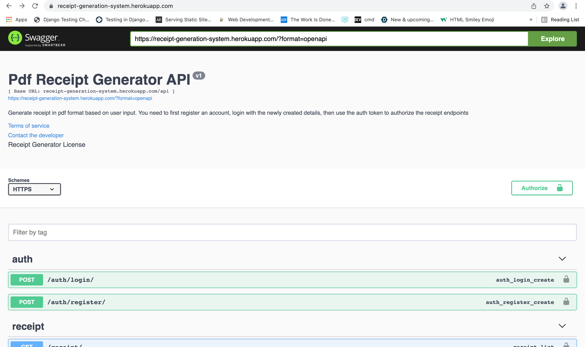

# Receipt Generation System

This application takes in user input in the form `name` , `address`, `phone number`, `total cost` and then generates a receipt in Pdf format then stores it on the backend server.

## Tools Used
Python, Django, Django Rest Framework, Swagger UI and xhtml2pdf

## Code Usage
- Clone the repository
- Create and activate your environment 
  - For mac/unix users: 

     **create:** ```python3 -m venv env```

     **activate:** `source env/bin/activate`

  - For windows users: 

    **create:** `py -m venv env`

    **activate:** `.\env\Scripts\activate`
    
 - Install all requirements
 ```shell
       pip install -r requirements.txt
 ```
 - Make migrations
```shell
       python3 manage.py makemigrations
 ```
 - Migrate changes
```shell
       python3 manage.py migrate
 ```
 
## Testing the application
 - Run the following command to run test the receipt and authentication applications
```shell
       python3 manage.py test
 ```
 
## Running the application
  - Run the following command to run the code in development mode
```shell
       python3 manage.py runserver
 ```
 
## Link to deployed application
Application was deployed on the heroku server and it can be accessed via [this link](https://receipt-generation-system.herokuapp.com/)

## Preview
Below is an image of the Swagger UI for the application
<br>
 
